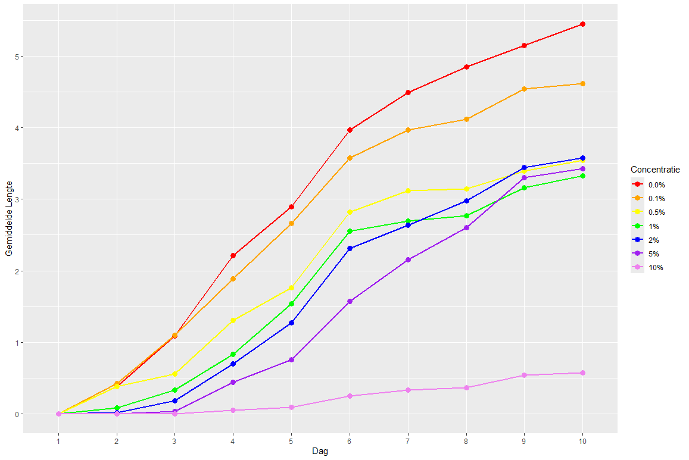
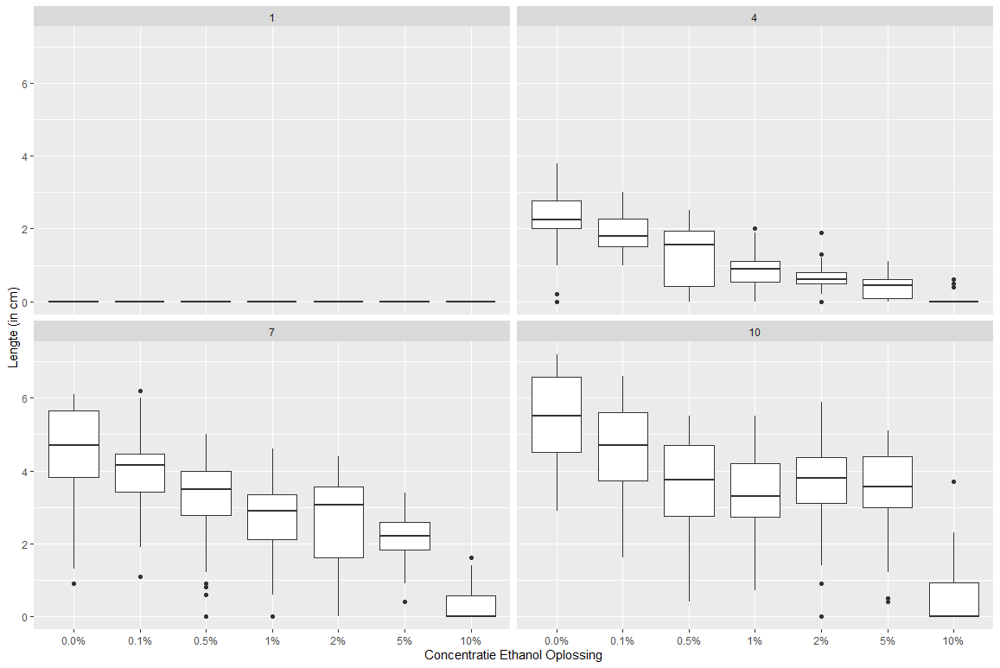
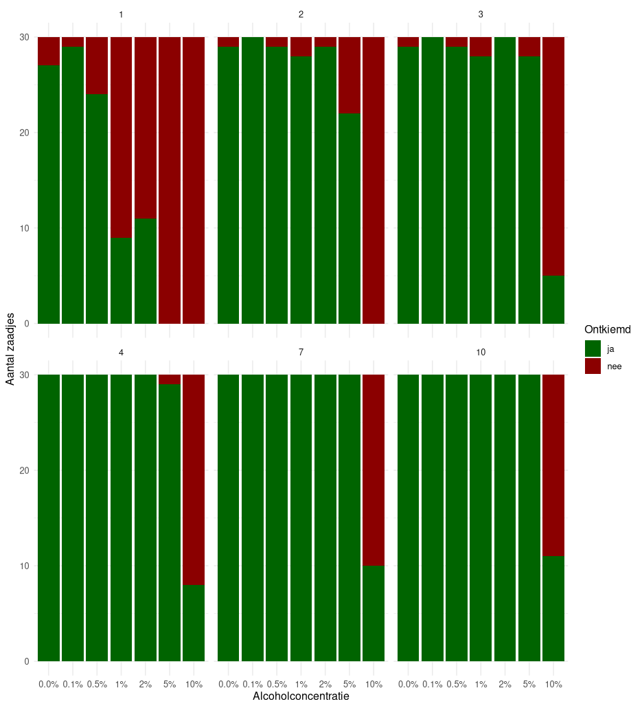
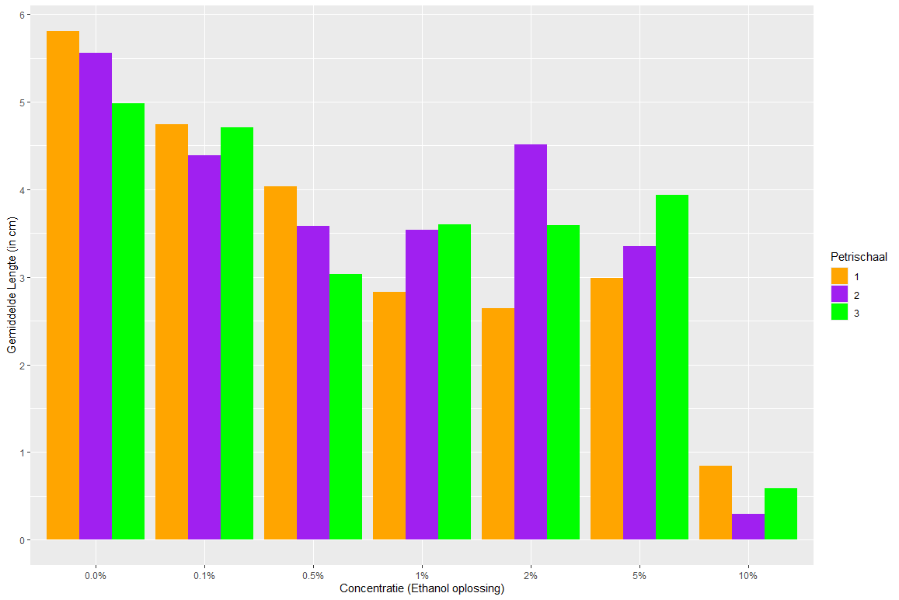

# Intoruductie
Kijken wat het effect van alochol is op de groei van planten, in dit geval specifiek het effect op de tuinkers. Dit doen door de planten water te geven gemixt met verschillende alcohol concentraties

# Project beschrijving:
https://github.com/UpiPie/Alcoholishe-tuinkers

# Onderzoeksvraag en hyptohese
Dit leidt  dan tot de volgende primaire onderzoeksvraag:
"Wat is het effect van verschillende alcoholpercentages op de groei van de tuinkers?"
 
En de nulhypothese (h0):
"Alcohol zal geen effect hebben op de groei van de tuinkers."
 
En de hypothese (h1):
"Alcohol heeft een negatief effect op de groei van de tuinkers. Hoe hoger het alcoholpercentage, hoe slechter de plant zal groeien en bij te hoge concentraties zal hij helemaal niet meer groeien.
 
Daarnaast hebben we nog wat extra zijvragen:
Vraag: "Is er een verandering in kleur, naarmate de alcoholconcentratie toeneemt?"
h0: "De alcoholconcentratie heeft geen effect op de kleur van de planten." 
h1: "Naarmate de alcoholconcentratie toeneemt, zal de plant lichter van kleur worden."
 
Vraag: "Is er een verandering in vorm, naarmate de alcoholconcentratie toeneemt?"
h0: "De alcoholconcentratie heeft geen effect op de vorm van de planten." 
h1: "Naarmate de alcoholconcentratie toeneemt, zal de plant niet meer instaat zijn rechtop te staan"
 
Vraag: "Verandert het aantal ontkiemende zaadjes, naarmate de alcoholconcentratie toeneemt?"
h0: "De alcoholconcentratie heeft geen effect op het aantal ontkiemde zaadjes." 
h1: "Naarmate de alcoholconcentratie toeneemt, zullen minder zaadjes ontkiemen."

# Data
De data gemeten gedurende het experiment is te zien in raw_data/2026-05-growth-tuinkers-alcohol.csv

# Logboek

# 18-5-2026

Doel: Experiment klaar zetten en laten starten. 
Motivatie: Experiment willen doen anders geen experiment
Uitgevoerde werkzaamheden: We hebben petrischaaltjes met watjes gevult en willekeurig naast elkaar gezet, dan hebben we er zaadjes op gelegt (10 per bakje). Daarna hebben we de corrosponderende alcohol concentratie bij de petrischaaltjes gedaan. We hebben ook nog dan de doppen van de petrischaaltjes er weer op gelegt om verdamping van alcohol tegen te gaan. 

Resultaten: Het experiment is nu begonnen. 

# 20-5-2026
Doelen: 
        1. Fabian en ik gaan vandaag uitzoeken wat voor statische methodes er mogelijk zijn om te gebruiken / handig
        2. Fabian en ik gaan vandaag uitzoeken welke plots handig zouden zijn voor onze resultaten in te verwerken.
Werkzaamheden: We hebben hiervoor de docent gevraagt wat die handig zou vinden om tests uit te voeren hier kwam uit dat een one-way ANOVA test en een chi-test handig waren. Verder hebben we aan de docent nog gevraagd wat handig zou zijn voor de plots hier kwam uit dat box-plotjes voor de lengte handig zijn en een bar plot voor de ontkiemingsaantal.

Conclusie: Hierdoor weten we welke statische tests we moeten doen en welke plots we moeten gebruiken, dit kunnen we dan een andere keer echt gaan doen.

# 21-5-2026
Doel: Alle files in de github zetten en op de goeie plek om klaar te maken voor de midterm review.
Uitgevoerd: We hebben het protocol in de github gezet en het abstract en mapjes aangemaakt. mapjes: raw_data, protocols, publication, analysis

Conclusie: Door deze files erin te zetten is het klaar voor de midterm review

# 26-5-2026

Doel: Afmaken presentatie journal club en tekst voor presenteren

Uitgevoerd: Ik heb de presentatie gemaakt en mijn tekst geschreven over het volgende artikel: https://journals.plos.org/plosone/article?id=10.1371/journal.pone.0187779&ck_subscriber_id=1986989217
Resultaat: Ik ben nu volledig klaar om een goed cijfer te halen voor de presentatie.

# 3-6-2026

Doelen:
        1. Onze data verplaatsen van een spreadsheet per dag naar een spreadsheet die goed te indexeren is voor R dag 5 tm 10
        2. Code schrijven om grafieken te maken barplot voor ontkiemings aantal, boxplot voor lengte en een grafiek om lengte te laten zien per concentratie voor over de periode van tijd.
        3. Statistische tests uitvoeren die de docent had verteld en bij zoeken als nodig (one-way anove en chi-test)

Uitgevoerde dingen:
        1. Ik heb de data verplaatst naar de spreadsheet per dag van alle lengtes.
        2. Fabian en ik hebben de code geschreven voor deze grafieken
        3. Fabian en ik hebben de code geschreven om een one-way anova test te doen op onze data en de tukeyHSD (vervolg test op one-way ANOVA) test om verschillende concentraties met elkaar te vergelijken. Verder hebben we ook nog een chi-test gedaan waarbij we vergeleken of er een verband staat tussen concentratie en ontkieming.
tukeyHSD: https://www.socscistatistics.com/tutorials/tukey-hsd/

Lengte grafiek:

Lengte boxplot:

Ontkiemingsaantal barplot:

Conclusie: Nu hebben we onze statistiche tests en grafieken voor ons verslag.

# 8-6-2026 

Doel: Beginnen aan het artikel, onze eerdere meetprotocol inleiding etc allemaal te verwerken tot artikel vorm.

Uitgevoerd: Onderzoeksopzet, Materiaal, Behandeling, Experiment omstandigheden en meetprotocool

Ik ben begonen aan het schrijven van het artikel, hierbij heb ik het volgende geschreven: onderzoeksopzet, Materiaal, Behandeling, Experiment omstandigheden en meetprotocol. Hierdoor kunnnen we morgen verder met de resultaten conclusie en discussie verwerken.

# 9-6-2026

Doelen:
        1. Artikel afmaken
        2. Extra grafiek maken om petrischaaltjes met elkaar te vergelijken
        3. Tekst opfixen van onderzoeksopzet en materiaal en verder het artikel vernetten.
Uitgevoerden taken:
        1. Ik heb de discussie geschreven.
        2. Fabian en ik hebben een extra bar plot gemaakt waarbij je kan zien de gemiddelde lengte van ieder petrischaaltje per concentratie op dag 10.
        3. Ik heb mijn tekst van onderzoeksopzet en materiaal niet meer dubbel op gemaakt. 
        4. Ik heb ons word document omgezet naar Rmd en een folder verslag gemaakt waarbij alle foto's in staan van ons verslag.
        5. Ik heb mijn logboek opgenet en afgemaakt.
        6. Readme gemaakt.
        7. Abstract afgemaakt.
        
Barplot van petrischaaltjes:

Conclusie: Het is nu klaar om inteleveren!