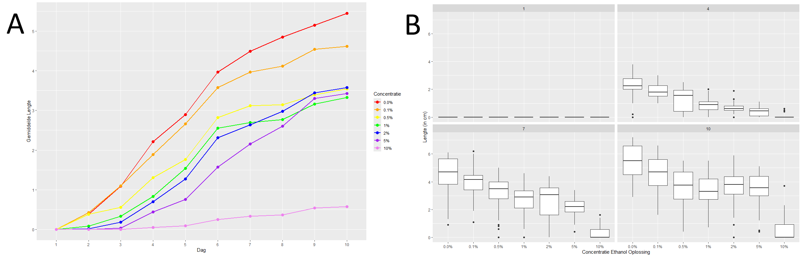
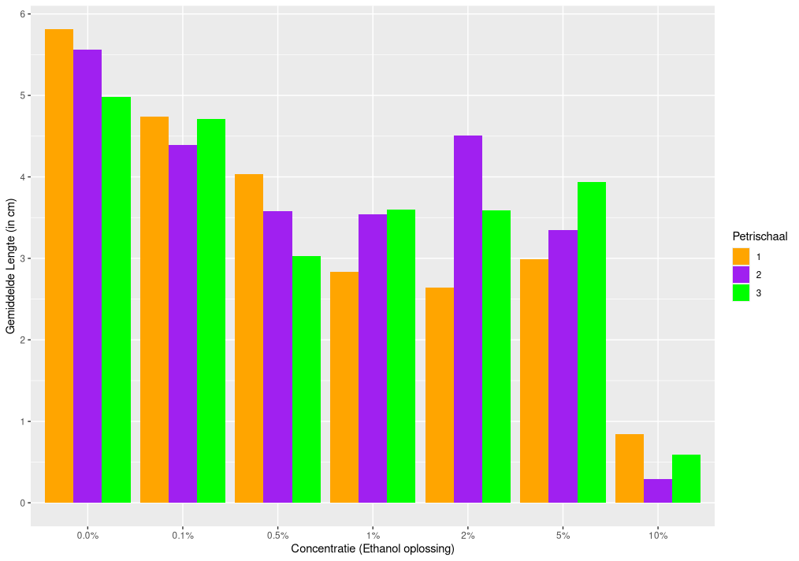
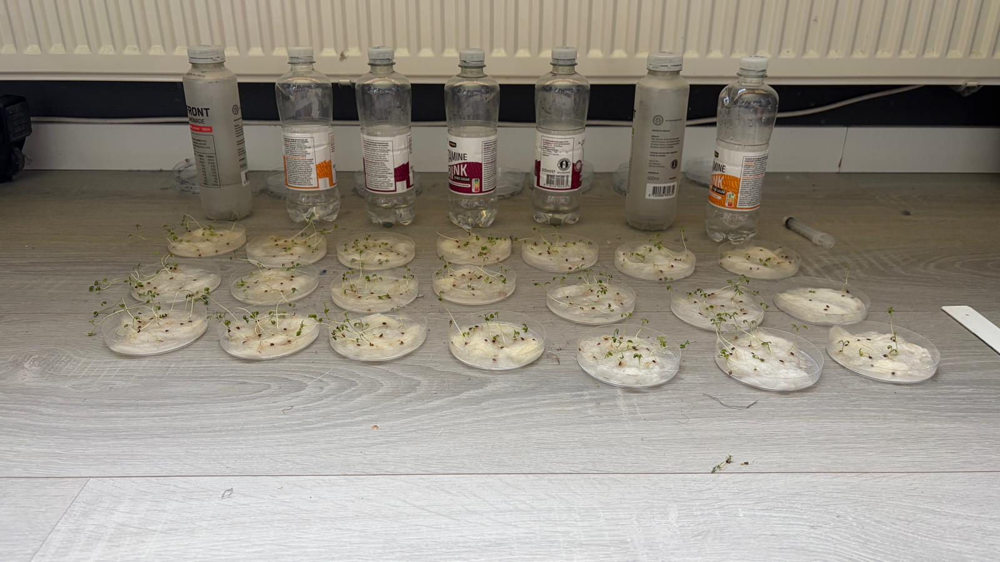
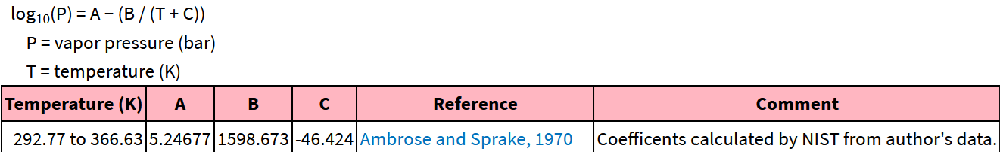
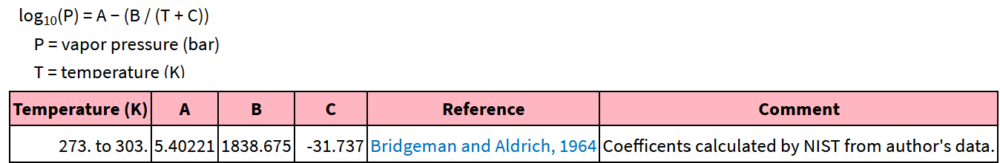
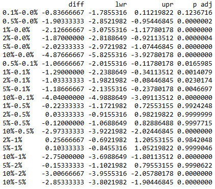

# Abstract

Invloed van ethanol op de groei en ontkiemingsaantal van de tuinkers (Lepidium sativum)

Planten zijn een essentieel onderdeel van ons ecosysteem. Overal op aarde zijn ze te vinden en om dit mogelijk te maken zijn er veel verschillende plantensoorten die onder verschillende omstandigheden kunnen overleven. Alcohol komt in de natuur zelden voor in deze ondergrond. Daarom is het interresant om te onderzoeken hoe ze hier op zouden reageren.
In dit onderzoek wordt gekeken naar hoe tuikersen reageren op verschillende concentraties alcohol in water.
Specifiek naar de invloed die het heeft op de lengte, kleur en vorm van de plant en wat voor invloed dit heeft op de ontkieming ratio van de zaadjes.
Tuinkerszaadjes worden gedurend een periode van 10 dagen blootgesteld aan verschillende ethanolconcentraties: 0.0%, 0.1%, 0.5%, 1%, 2%, 5% en 10%. Per concentratie zijn er drie petrischaaltjes met 10 tuinkerszaadjes per schaaltje. Dagelijks word het aantal ontkiemde zaadjes geteld en de lengte van de stam per petrischaaltje. 
De resultaten tonen aan dat ethanol, onder deze experimentele omstandigheden, een remmend effect hebben op de groei en dus de lengte van de tuinkers. Dit effect is goed te zien bij de hoogste concentratie 10% waarbij lengte en ontkiemingsaantallen sterk achterbleven in vergelijking tot de andere concentraties. Bij lagere concentraties is het effect op het ontkiemingsaantal minder sterk, maar de gemiddelde lengte blijft wel lager dan bij de controlegroep. Het ethanol lijkt onder deze omstandigheden geen effect te hebben op kleur of vorm van de planten. Ondanks de genoemde beperkingen laat het onderzoek wel zien dat ethanol vooral invloed heeft op de plant zijn groei en dat het alleen invloed heeft op het ontkiemingsaantal bij hoge percentage ethanol oplossingen. 

# Introductie

Planten zijn één van de hoekstenen van onze samenleving. Ze komen dan ook in vele vormen en maten en onder veel verschillende omstandigheden voor in de natuur. Van cactussen in woestijnen tot bomen in de jungle, het maakt niet uit waar je bent of de kans is groot dat er wel een plantsoort voorkomt. Om dit mogelijk te maken moeten planten tegen veel verschillende stress-factoren kunnen. Denk hierbij aan droogte, een overvloed aan water of bijvoorbeeld aan een zoute bodem. Over het algemeen kunnen planten slecht tegen een zoute bodem. Dit komt doordat op het moment dat de bodem veel zout bevat, dit veel water aantrekt en vasthoudt, waardoor het moeilijker wordt voor planten om genoeg water op te nemen en vast te houden. Toch hebben planten hier enige maatregelen tegen ontwikkeld. Zo kunnen ze zowel de hyper osmotische stress als de aanwezigheid van NA+ detecteren, beide gevolgen van een hoog zoutgehalte. Vervolgens kunnen ze zich op meerdere manieren beschermen tegen dit zoutgehalte. Zo kunnen ze de expressie van transcriptiefactoren aanpassen, verzamelen ze osmolyten om een laag intracellulaire osmotisch potentieel te houden en kunnen ze hun eigen NA+ en K+ gehaltes reguleren via kanalen en transporters [1].

Een andere stressfactor kan de hoeveelheid alcohol in de bodem zijn. Dit is iets wat in de natuur veel zeldzamer is dan bijvoorbeeld droogte of zout, en is ook minder onderzoek naar gedaan. Toch zijn er wel onderzoeken gedaan naar het effect van alcohol. 1 studie keek naar het effect van alcohol door zaden eerst voor 3 uur in alcohol te laten weken en ze daarna te planten [2].  Hieruit bleek dat het laten weken van zaden in welke alcohol concentratie dan ook een negatief effect had op het ontkiemingsaantal. Terwijl het juist een positief effect had op het gewicht van zowel de stam als de wortel. De meest logische verklaring die ze konden vinden is dat de alcohol de meest zwakke zaden elimineert waardoor alleen de beste zaden uiteindelijk tot groeien kwamen. Een ander artikel deed juist onderzoek naar het effect van ethanol als dit door de wortels van een plant, in dit geval papier witte narcissen, werd opgenomen. Hierin werd gevonden dat ethanol opgelost in water zorgde voor een afgenomen groei in bladeren en stam, waarbij dit een sterker effect had naarmate de ethanol gehalte opliep. Bij concentraties van 10% of hoger was dit zelfs giftig en stierf de plant af.  Aangezien de bedoeling van het experiment was om te kijken of mensen hier thuis gebruik van konden maken, om zo hun narcissen kleiner en langer mooi te houden, hebben ze ook getest of verschillende bronnen van alcohol bruikbaar zijn. Hieruit bleek dat sterkere dranken, zoals wodka en gin, vergelijkbare resultaten gaven als ethanol als deze tot 4-5% werden verdund, maar dat wijn en bier hier niet geschikt voor waren [3].

Dit laatste experiment trok de aandacht, en heeft dan ook dit experiment geïnspireerd. Hiervoor hebben we gekeken naar het effect van verschillende ethanol concentraties op de tuinkers (Lepidium sativum). Hierbij is niet alleen het effect van ethanol op de groei van de plant, dus de lengte van de stam, getest, maar ook het effect op het ontkiemingsaantal, de kleur en de vorm van de planten.

# Material en Methode

### Onderzoeksopzet

Om het effect van alcohol op de groei van de tuinkers te testen, werden er zeven verschillende groepen opgesteld: een controlegroep met 0.0% ethanol en zes groepen met verschillende ethanol concentraties in het water: 0.1%, 0.5%, 1%, 2%, 5%, 10%. Voor elke groep werden drie petrischaaltjes gebruikt, in totaal dus 21 schaaltjes. In ieder schaaltje werden er 10 tuinkerszaadjes geplaatst op watten, dus in totaal 210 zaadjes. Uiteindelijk is er over een periode van 10 dagen elke dag gemeten hoeveel zaadjes er ontkiemd waren en de lengte van de stammen van deze planten. Op de laatste dag is er ook nog gekeken naar de vorm en kleur van de planten, en is dit ook vastgelegd op foto’s.

### Material

Voor het experiment werden er 210 tuinkerszaadjes, 21 petrischaaltjes, watten, water en 96% ethanol gebruikt. Voor het maken van de ethanoloplossingen voor 11 dagen, dus met één dag extra om verlies door morsen op te vangen, is ongeveer 64 ml 96% ethanol nodig en 2,25 liter water. De oplossingen werden toegediend aan de plant doormiddel van een 10ml pipet. De lengte van de plant werd gemeten doormiddel van een geodriehoek. De petrischaaltjes werden ook gelabeld met hun bijbehorende ethanolconcentratie.

### Voorbereiding

Op dag 0 worden de petrischaaltje gelabeld, bedekt met watjes en ingelegd met tien zaden. Ook worden de alcohol concentraties gemaakt en krijgen de petrischalen hun eerste lading 10ml ethanol oplossing. Vervolgens worden de petrischalen op een lichte plek, maar niet direct in de zon.

### Dagelijkse handelingen

Dagelijks kregen de planten 10ml van de bijbehorende ethanol oplossing. Vervolgens werd ook voor elk petrischaaltje genoteerd hoeveel zaden waren ontkiemd en gemeten en genoteerd hoelang de stam van elk plantje was, met behulp van een geodriehoek. De lengte die werd gemeten was puur de lengte van de stam, dus exclusief de wortel en bladeren. Mochten de planten krom staan/liggen, werden deze voorzichtig recht gehouden. Op dag 10 werd ook de kleur en vorm van de planten vastgelegd aan de hand van fotos. 

# Resultaten

Ethanol blijkt een goeie remmer te zijn voor de groei van de tuinkers. Afhankelijk van de concentratie remt het de groei van de plant, zowel als de ontkiemingsratio voor een 10% concentratie. De hoeveelheid waarin dit wordt geremd is wel erg afhankelijk van de concentratie. Zo wordt de lengte minimaal geremd door een 0.1% concentratie, voor 0.5-5% is er een significant verschil te zien en voor 10% is er zelfs nauwelijks groei. De verschillen hierin worden al zichtbaar vanaf dag twee/drie, zoals te zien in figuur 1A.  Daarnaast is ook te zien dat de planten met de 0,5% en 1% ethanol oplossing in eerste instantie sneller beginnen met groeien, maar naarmate het experiment verder komt worden ze bijgehaald door de 2 en 5% oplossingen. Uiteindelijk is er op dag 10 zelfs geen significant verschil in lengte tussen de planten met de 0,5%, 1%, 2% en 5% ethanol oplossing.

Figuur 1: (A) Grafiek van de gemiddelde lengte (in cm) van de planten per dag per ethanol concentratie. (B) Boxplots met lengte van de planten (in cm) voor verschillende ethanol concentraties. Dit is van links naar rechts en boven naar beneden voor dag 1, 4, 7 en 10 zoals ook boven elke plot staat aangegeven. 

Naast de lengte van de planten hebben we ook gekeken naar het ontkiemingsaantal onder verschillende ethanol concentraties. Als er alleen zou worden gekeken naar dag 10 is er te zien dat alleen voor de planten in de 10% ethanol oplossing niet alle zaadjes zijn ontkiemd, wat dus wel het geval was voor alle andere concentraties. Echter als je ook kijkt naar eerdere dagen, zoals getoond in figuur 2, zie je dat er zeker in de eerste dagen een verschil te zien is in het ontkiemingsaantal. Zeker op dag 1 is te zien dat zaden in de hogere ethanoloplossing moeite hebben met ontkiemen, en dat dit in de lagere concentraties wat eerder gebeurt. Echter zijn vanaf dag 3/4 zo goed als alle zaadjes ontkiemt, behalve degene in de 10% ethanoloplossing. 

Figuur 2: Plots met de hoeveelheid ontkiemde zaadjes per ethanolconcentratie.  Het totaal per concentratie is 30 zaden en dit is weergegeven voor dag 1, 2, 3, 4, 7 en 10. Elke dag staat ook aangegeven boven de bijbehorende plot.

Verder is ook nog gekeken of eventueel het nummer van het petrischaaltje waarin de planten groeiden impact had op de groei, gezien de petrischaaltjes met nummer 1 voor nummer 2 stonden, en die dan weer voor nummer 3 stonden. Het had kunnen zijn dat deze petrischaaltjes daardoor net wat betere of juist slechtere condities hadden en daardoor impact hadden op de groei. Echter is in figuur 3 te zien dat de petrischaal nummer geen impact lijkt te hebben op de groei. Er is geen duidelijk patroon te koppelen aan het petrischaal nummer en welke petrischaal gemiddeld de hoogste lengte heeft is afhankelijk van welke ethanolconcentratie je bekijkt.

Figuur 3: De gemiddelde lengte (in cm) per concentratie ethanol oplossing per petrischaal. Dit zijn de gegevens voor dag 10.

Als laatst is ook nog gekeken of de ethanol concentratie invloed had op de kleur en of vorm van de planten.  Zoals te zien is in figuur 4, hebben de verschillende ethanol concentraties geen effect gehad op de vorm en/of kleur. Alleen de kleur van de planten bij de 10% ethanol concentratie hebben een lichtere kleur, maar dit is te verklaren met dat deze later ontkiemd zijn, en dus waarschijnlijk nog in een vroeger stadium van de groei. De kleur van deze planten komt overeen met de kleur van de planten van andere ethanol percentages, tijdens dit moment van de groei. Ook de vorm is redelijk overeenkomend. De stammen van de plantjes liggen vaak gebogen of krom en hebben moeite met recht overeind blijven. Dit geld voor alle ethanol concentraties.

Figuur 4: Van links naar rechts oplopende ethanol concentraties: 0, 0.1, 0.5, 1, 2, 5, 10.

# Statistische analyse

Om al deze aannames te bevestigen zijn er meerdere statistische analyses losgelaten op deze data. Als eerst is er gekeken naar of er een significant verschil zit in de lengte van de planten voor verschillende. Om dit te zien hebben we hier eerst een one-way ANOVA-test op uitgevoerd. Hieruit kwam een p-waarde van <2e-16, wat betekent dat tussen in ieder geval twee groepen een significant verschil in lengte zit. Om te kijken voor welke groepen dit geld hebben we vervolgens een Tukey HSD test gedaan. Hieruit kwamen de volgende resultaten. Tussen 0.0% en 0.1% zat geen significant verschil in lengte en tussen alle combinaties van 0.5% t/m 5% zat onderling ook geen significant verschil in lengte. Voor alle andere combinaties was er wel een significant verschil in lengtes. De exacte p-waardes voor elke combinatie is ook terug te vinden in Tabel 1, onder de berekeningen.

Voor het ontkiemings-aantal is er een Chi-test gedaan om te kijken of er een verband is tussen de ethanol concentratie en het ontkiemingsaantal. Ook hier komt een zeer lage p-waarde uit, <2.2e-16, wat betekent dat er een significant verband zit tussen de concentratie en het ontkiemingsaantal.

Als laatste is ook nog getest of er een significant verschil zit in de lengte tussen de verschillende petrischaaltjes per concentratie. Hiervoor is ook een one-way ANOVA-test uitgevoerd. Hieruit kwam een p-waarde van 0.923. Dit betekent dat er geen significant verschil in lengte zit voor de verschillende petrischaal nummers.

# Discussie

Deze resultaten wijzen erop dat ethanol invloed had op de ontkieming en groei van de tuinkers. Dit effect was vooral goed te zien bij de concentratie 10%, waarbij als enige groep niet alle zaadjes waren ontkiemd en de gemiddelde lengte lager lag dan bij andere groepen. Bij de lagere ethanolconcentraties was het verschil met de controlegroep vooral zichtbaar in de lengte.
Deze resultaten sluiten aan bij een eerder onderzoek van Kern et al. [6]. Zij vonden dat ethanolconcentraties van 0.25% tot 1.5% een remmend effect hadden op de ontkieming en de groei van Euphorbia heterophylla. In ons onderzoek was de remming van de ontkieming vooral zichtbaar bij de 10% groep, terwijl de groei ook bij lagere concentraties lager was dan bij de controlegroep.

Er zijn wel enkele beperkingen die de resultaten zouden kunnen beïnvloed. 
De temperatuur en lichtintensiteit zijn niet actief gemeten. Hierdoor is niet met zekerheid vast te stellen of veranderingen in temperatuur of lichtintensiteit invloed hebben gehad op de groei en ontkieming van de tuinkers. Verder zijn de petrischaaltjes ook nog van kamer verplaatst, waardoor de leefomstandigheden mogelijk licht zijn veranderd. Omdat de petrischaaltjes in hetzelfde huis bleven was de verandering waarschijnlijk beperkt.

Een andere beperking is dat het aantal watjes per petrischaaltje niet volledig constant was. Hierdoor kan de hoeveelheid vocht die werd vastgehouden per petrischaaltje verschillen. Dit kan invloed hebben gehad op de beschikbaarheid van water en ethanol voor de tuinkerszaadjes. Daarnaast kunnen er ook nog meetfouten zijn gemaakt met het handmatig meten van de plantlengte met een geodriehoek. Dit gebeurde voornamelijk wanneer stengels gebogen waren. 

Daarnaast zou verdamping van ethanol mogelijk invloed kunnen hebben gehad op de werkelijke ethanolconcentratie in de petrischaaltjes. Op basis van de Antoine-vergelijking werd berekend dat ethanol bij 20 °C een dampdruk heeft van 5,85 kPa, terwijl water met dezelfde temperatuur een dampdruk heeft van 2,34 kPa [4,5].  De volledige berekening staat in de bijlagen. Ethanol heeft bij 20 °C dus een hogere dampdruk dan water, wat betekent dat ethanol makkelijker verdampt en vluchtiger is dan water. 
Doordat de petrischaaltjes niet waren afgesloten, kan een deel van het ethanol zijn verdampt. Hierdoor kan de werkelijke ethanolconcentratie waaraan de plant werd blootgesteld gedurende de dag lager zijn geweest dan de oorspronkelijke berekende concentratie

Voor een vervolgonderzoek zou het experiment betrouwbaarder moeten worden uitgevoerd, door de temperatuur en lichtintensiteit actief te meten. Verder moet in ieder petrischaaltje hetzelfde aantal watjes geplaatst worden en de petrischaaltjes moet gedurende het experiment de hele tijd onder dezelfde leefomstandigheden zitten. Daarnaast zou verdamping van ethanol beperkt moeten worden door de petrischaaltjes afte sluiten, maar er moet dan nog wel voldoende lucht bij de tuinkers komen. 
Een interessant vervolgonderzoek zou kunnen zijn om de invloed van ethanol op waterplanten te onderzoeken. Bij waterplanten zou het ethanol zich rond om de plant bevinden, waardoor de plant dan op een andere manier wordt blootgesteld dan de tuinkers. Dit zou mogelijk andere effecten kunnen veroorzaken.

Samenvattend, de resultaten tonen aan dat ethanol, onder deze experimentele omstandigheden, een remmend effect hebben op de groei en dus de lengte van de tuinkers. Dit effect is goed te zien bij de hoogste concentratie 10% waarbij lengte en ontkiemingsaantallen sterk achterbleven in vergelijking tot de andere concentraties. Bij lagere concentraties is het effect op het ontkiemingsaantal minder sterk, maar de gemiddelde lengte blijft wel lager dan bij de controlegroep. Het ethanol lijkt onder deze omstandigheden geen effect te hebben op kleur of vorm van de planten. Ondanks de genoemde beperkingen laat het onderzoek wel zien dat ethanol vooral invloed heeft op de plant zijn groei en dat het alleen invloed heeft op het ontkiemingsaantal bij hoge percentage ethanol oplossingen.

# Bronnen

[1] Deinlein U, Stephan AB, Horie T, Luo W, Xu G, Schroeder JI. (2014). Plant salt-tolerance mechanisms. https://pubmed.ncbi.nlm.nih.gov/24630845/ 
[2] Pearl R, Allen A. (1926). THE INFLUENCE OF ALCOHOL UPON THE GROWTH OF SEEDLINGS. https://pmc.ncbi.nlm.nih.gov/articles/PMC2140761/ 
[3] William B. Miller, Erin Finan. (1 Jan 2026). Root-zone Alcohol Is an Effective Growth Retardant for Paperwhite Narcissus https://journals.ashs.org/view/journals/horttech/16/2/article-p294.xml 
[4] National Institute of Standards and Technology. Ethanol. NIST Chemistry WebBook. Beschikbaar via: https://webbook.nist.gov/cgi/cbook.cgi?ID=C64175&Plot=on&Type=ANTOINE [5] National Institute of Standards and Technology. Ethanol. NIST Chemistry WebBook. Beschikbaar via:https://webbook.nist.gov/cgi/cbook.cgi?ID=C7732185&Plot=on&Type=ANTOINE
[6] Kern KA, Pergo EM, Kagami FL, Arraes LS, Sert MA, Ishii-Iwamoto EL. (2009). The phytotoxic effect of exogenous ethanol on Euphorbia heterophylla L. https://pubmed.ncbi.nlm.nih.gov/19640725/

### Berekening

Ethanol:

T=273.15+20 = 293.15
Log10(p) = 5.24677 - (1598.673 / (293.15-46.424)) 
Log10(p) = 5.24677-1598.673/246.726
Log10(p) = 5.24677- 6.47954816274
Log10(p) = -1.23277816274
10^-1.23277816274= 0.0585 bar
0.0585 bar = 5.85 kPa

Water:
{width=100%}
T=273.15+20 = 293.15
Log10(P) = 5.40221 – (1838.675 / (293.15 - 31.737))
Log10(P) = 5.40221 - 1838.675/261.413
Log10(P) = 5.40221 - 7.0336
Log10(P) = -1.63139
10^-1.63139= 0.0234 bar
0.0234 bar = 2.34 kPa

## Tabel

Tabel: Resultaten Tukey HSD test op lengtes voor verschillende concentraties ethanol. Als de p-waarde onder de 0.05 ligt is er een significant verschil in lengte tussen de twee ethanol concentraties.
